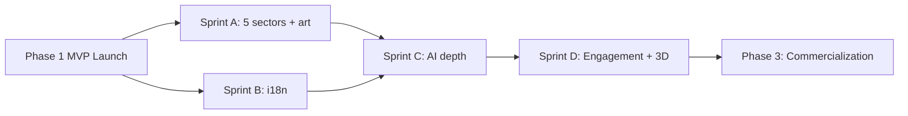

# Naija2050 — Build Plan (Phase 1 & Phase 2)

**Derived from:** [Nigeria2050_PRD.md](./Nigeria2050_PRD.md) · [MVP_PLAN.md](./MVP_PLAN.md)  
**Last updated:** August 17, 2026

---

## Overview

| Phase | Goal | Timeline (est.) | Status |
|---|---|---|---|
| **Phase 1** | Ship MVP — history + 6 sectors + fusion + AI core | Weeks 0–8 | ✅ Engineering complete · launch prep in progress |
| **Phase 2** | Expand content, localization, AI depth, engagement | Months 3–9 post-launch | 📋 Planned |

---

# Phase 1 — MVP Launch

Phase 1 is the full co-equal product described in the PRD: neither history nor future vision ships without the other.

## 1.1 Deliverables (built)

### Product pillars

| Deliverable | Route / location | Notes |
|---|---|---|
| Home | `/` | Hero metrics, pillar overview, sector grid, Ask the Archive CTA |
| 6 sector vision pages | `/sectors/[slug]` | Editorial hero, baseline chart, scenario ranges, interactive milestone timeline, How We Got Here, assumptions/risks, sources |
| Interactive history timeline | `/timeline` | 8 eras, 17 entries, scrollytelling spine, era scrubber, sector cross-links |
| Now vs. 2050 comparator | `/compare` | Morph slider, 8 metrics |
| Ask the Archive | `/ask` | Client-side RAG, sourced answers, out-of-scope guardrails |
| Source library | `/sources` | 16 sources, sector + era filters |
| Glossary | `/glossary` | 12 terms + inline `AutoGlossary` |
| Methodology | `/methodology` | Editorial policy, correction contact |
| Editorial review queue | `/editorial/review` | Internal sign-off tracker |

### Fusion mechanism

- Sector pages → timeline via **How We Got Here** (`TrackedLink` + analytics)
- Timeline entries → sectors via **Why this matters for 2050**
- Cross-pillar events tracked in `src/lib/analytics.ts`

### Engineering infrastructure

- Next.js 15 App Router, TypeScript, Tailwind v4 semantic tokens
- CI: lint, typecheck, build (`.github/workflows/ci.yml`)
- SEO: metadata, OG image, sitemap, robots
- Accessibility: skip link, reduced-motion + data-saver modes
- Hydration-safe motion (`AnimatedCounter`, `FadeIn`, `useMounted`)
- Dev cache guards (`scripts/ensure-dev-stopped.mjs`, `scripts/stop-dev.mjs`)
- Optional Plausible production analytics (`NEXT_PUBLIC_PLAUSIBLE_DOMAIN`)

### Content library

| Asset | Count |
|---|---|
| Sources | 16 |
| Timeline eras | 8 |
| Timeline entries | 17 |
| Sectors | 6 |
| Glossary terms | 12 |
| Comparator metrics | 8 |

---

## 1.2 Launch checklist (remaining)

### Deploy (owner: engineering)

- [ ] Stop local dev server before production build (`npm run stop:dev`)
- [ ] Verify clean build: `npm run typecheck && npm run lint && npm run build`
- [ ] Merge `dev` → `main`
- [ ] Connect repo to Vercel; set env vars:
  - `NEXT_PUBLIC_SITE_URL` → production domain
  - `NEXT_PUBLIC_PLAUSIBLE_DOMAIN` → optional analytics
- [ ] Smoke-test all routes on production URL
- [ ] Confirm OG image and sitemap resolve on production domain

### QA (owner: product)

- [ ] Cross-browser pass: Chrome, Safari, Firefox, mobile Safari/Chrome
- [ ] Lighthouse audit on 4G throttled — target ≥ 80 performance, ≥ 90 accessibility
- [ ] Test data-saver mode and `prefers-reduced-motion`
- [ ] Verify Ask the Archive declines out-of-scope queries
- [ ] Test interactive milestone timeline (click + keyboard navigation)

### Editorial (owner: content — **launch blocker**)

- [ ] Historian review: Civil War timeline entry
- [ ] Economist review: Economy + Security sector projections
- [ ] Sign off editorial review queue items marked `pending-review`
- [ ] Final proofread of methodology page

### Post-launch (week 1)

- [ ] Share launch URL on primary distribution channel (diaspora / education / press)
- [ ] Monitor Plausible for cross-pillar nav rate and morph slider engagement
- [ ] Triage correction emails via methodology contact

---

## 1.3 Phase 1 success metrics (first 8 weeks)

From PRD Section 15 — track via Plausible + custom events:

| Metric | Target (directional) |
|---|---|
| Cross-pillar nav rate | > 15% of sessions hit a tracked sector↔timeline link |
| Morph slider interaction | > 20% of `/compare` sessions |
| Ask the Archive usage | > 10% of sessions with a grounded query |
| Methodology / sources visits | Evidence of skeptic checking (baseline TBD week 1) |
| Return visit rate | > 20% within 30 days |

---

## 1.4 Phase 1 explicit non-goals

- Multilingual content
- Additional sectors beyond the flagship 6
- User accounts or community submissions
- Real-time data feeds
- Native mobile app
- 3D/WebGL centerpiece
- Commissioned era illustration (CSS placeholders ship; art is Phase 2)

---

# Phase 2 — Expansion & Depth

Phase 2 grows the content library, deepens AI interactivity, and adds engagement loops — without compromising editorial independence.

**Estimated duration:** 6 months post-launch (3 engineering sprints + 3 content sprints, overlapping)

---

## 2.1 Sprint A — Content expansion (weeks 9–16)

### Five additional sectors (PRD Section 5)

| Sector | Slug (proposed) | Priority |
|---|---|---|
| Healthcare | `healthcare` | P0 |
| Agriculture & Food Security | `agriculture` | P0 |
| Creative Economy | `creative-economy` | P1 |
| Manufacturing & Industrialization | `manufacturing` | P1 |
| Financial Inclusion | `financial-inclusion` | P2 |

**Engineering:** sector template already supports new slugs via `src/content/sectors.ts` — no schema changes required.

**Content per sector:** baseline data, 2030/2040/2050 projections, scenario ranges, 2–3 historical waypoints, assumptions/risks, 3–5 new sources each.

**Timeline additions:** 5–8 new entries linking to new sectors where historically relevant.

### Commissioned era illustration

- Replace CSS era portals with consistent illustrated art (settings only — no real figure portraits, per PRD 9.2)
- Human review queue workflow before assets enter `public/art/eras/`
- Lazy-load, WebP/AVIF, data-saver fallback to CSS gradients

**Exit criteria:** 11 live sectors; timeline ≥ 22 entries; era art on ≥ 4 eras.

---

## 2.2 Sprint B — Localization (weeks 12–20)

### Languages (PRD Phase 2)

| Language | Priority | Approach |
|---|---|---|
| Hausa | P0 | Content JSON translation + `next-intl` or parallel content files |
| Yoruba | P0 | Same |
| Igbo | P1 | Same |

**Engineering tasks:**

- [ ] Add i18n routing (`/en/...`, `/ha/...`, etc.) or locale query param strategy
- [ ] Extract all UI strings to message catalogs
- [ ] Language switcher in header
- [ ] Translate glossary terms and methodology (legal/editorial sensitivity)
- [ ] Keep source citations in original language where appropriate

**Exit criteria:** Home, timeline, and 2 pilot sectors available in Hausa + Yoruba.

---

## 2.3 Sprint C — AI depth (weeks 16–24)

### "Your Nigeria 2050" personalized scenario (PRD 9.3)

- Guided flow: user picks 1–2 sectors → AI generates a "day in 2050" vignette
- **Strict grounding:** generation prompt includes only that sector's sourced projections
- Shareable card (OG image per vignette)
- Clear AI-generated labeling

**Engineering:**

- [ ] Server route or edge function for generation (OpenAI / Anthropic API)
- [ ] Rate limiting + cost caps
- [ ] Store no PII; optional anonymous session for share links

### AI-narrated audio walkthroughs (PRD 9.4)

- TTS for timeline eras and sector pages
- "Listen to Nigeria's story" mode — playlist UI on timeline
- Accessibility win + commute use case

**Engineering:**

- [ ] Pre-generate audio for static content (ElevenLabs / OpenAI TTS)
- [ ] `<audio>` player component with transcript fallback
- [ ] Data-saver: disable auto-load

**Exit criteria:** Your Nigeria 2050 live on `/your-2050`; audio on ≥ 8 timeline entries.

---

## 2.4 Sprint D — Engagement & flagship visuals (weeks 20–28)

### Quizzes & learning loops

- Era quiz after timeline sections ("Which era came first?")
- Sector knowledge checks ("What % of exports is oil today?")
- Results shareable; no accounts required
- Analytics: `quiz_complete` events

### Community correction flow

- Structured correction form linked from methodology
- Submissions to review queue (not auto-published)
- Visible "last reviewed" dates on contested entries

### 3D/WebGL centerpiece (PRD 8.2 stretch)

- Interactive Nigeria map — states light up by sector data on hover
- React Three Fiber; **optional enhancement** — static map fallback
- Single hero placement on home or `/explore`

**Exit criteria:** Quiz on timeline; correction form wired; 3D map prototype on home (beta flag).

---

## 2.5 Phase 2 infrastructure

| Area | Work |
|---|---|
| CMS | Evaluate headless CMS (Sanity / Contentful) if content update frequency increases |
| API | Structured content API for B2B licensing (PRD 12) |
| Analytics | Plausible goals dashboard; weekly cross-pillar report |
| Performance | Image CDN, route-level bundle analysis, Core Web Vitals monitoring |
| Testing | Playwright smoke tests for critical paths |

---

## 2.6 Phase 2 success metrics

| Metric | Target |
|---|---|
| Sectors viewed per session | Increase from ~1.5 to ≥ 2.5 |
| Localization traffic | ≥ 10% of sessions in non-English locales |
| Your Nigeria 2050 completions | ≥ 5% of returning visitors |
| Audio mode usage | ≥ 8% of timeline sessions |
| Correction submissions | Qualitative — credible engagement signal |

---

## 2.7 Phase 2 → Phase 3 bridge

Phase 3 (not scoped here) covers commercialization per PRD Section 12:

- Institutional licensing (schools, diaspora orgs)
- Supporter membership tier
- Sponsorship firewall policy
- White-label platform for other countries

Phase 2 should **not** introduce paywalls on core civic content or sponsor messaging on editorial pages.

---

## Dependency graph



Sprints A and B can run in parallel after launch. Sprint C depends on stable content (A) and preferably EN copy lock (B partial). Sprint D is last.

---

## Resource estimate (solo builder)

| Phase / sprint | Engineering | Content / editorial |
|---|---|---|
| Phase 1 launch prep | 3–5 days | 2–4 weeks external review |
| Sprint A | 1 week | 6–8 weeks |
| Sprint B | 3–4 weeks | 4–6 weeks per language |
| Sprint C | 3–4 weeks | 2 weeks prompt/grounding QA |
| Sprint D | 4–5 weeks | 2 weeks quiz copy |

---

## Quick reference — key commands

```bash
npm run dev              # Turbopack dev (port 3500)
npm run dev:clean        # Safe reset: stop dev → wipe .next → start
npm run stop:dev         # Free port 3500
npm run build            # Production build (blocks if dev is running)
npm run typecheck && npm run lint
```
