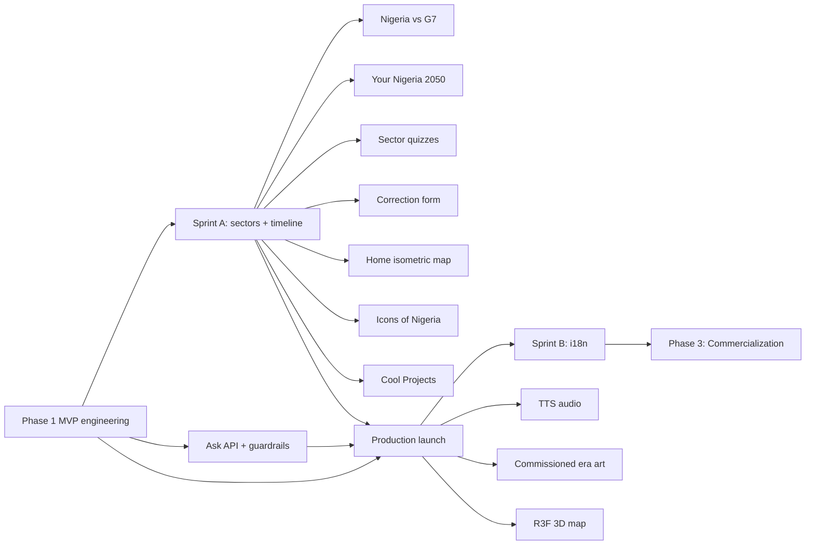

# Naija2050 — Build Plan (Phase 1 & Phase 2)

**Derived from:** [Nigeria2050_PRD.md](./Nigeria2050_PRD.md) · [MVP_PLAN.md](./MVP_PLAN.md)  
**Last updated:** August 18, 2026

---

## Status snapshot

| Phase | Goal | Status |
|---|---|---|
| **Phase 1** | Ship MVP — history + 6 sectors + fusion + AI core | ✅ Engineering complete · **launch blocked** on external editorial review + Vercel deploy |
| **Phase 2** | Expand content, localization, AI depth, engagement | ⚠️ **Content + engagement mostly shipped** (Icons, Cool Projects, Ask API) · i18n, audio, commissioned art, WebGL, CMS **deferred** |
| **Phase 3** | Commercialization (licensing, membership, white-label) | 🔮 Not started |

**What is live in the repo today:** 13 sectors, 26 timeline entries, 38 editorial sources (+ 150 icon citations), G7 comparator, Your Nigeria 2050, Icons of Nigeria (150), Cool Projects (26 editorial ideas + vote/submit, plus postal-code, road-sign, public-library, emergency-112, land-title, and grid-outage mocks), correction form, home map, 5 sector quizzes, privacy/terms, server-side Ask the Archive with expanded guardrails. **What is not:** production deploy, historian/economist sign-off, Hausa/Yoruba/Igbo, TTS audio, React Three Fiber map, headless CMS.

---

## Overview

| Phase | Goal | Timeline (est.) | Status |
|---|---|---|---|
| **Phase 1** | Ship MVP — history + 6 sectors + fusion + AI core | Weeks 0–8 | ✅ Engineering complete · launch prep in progress |
| **Phase 2** | Expand content, localization, AI depth, engagement | Months 3–9 post-launch | ⚠️ Engineering ahead of launch; remaining items deferred (see §2.8) |

---

# Phase 1 — MVP Launch

Phase 1 is the full co-equal product described in the PRD: neither history nor future vision ships without the other.

## 1.1 Deliverables (built)

### Product pillars

| Deliverable | Route / location | Notes |
|---|---|---|
| Home | `/` | Hero metrics, pillar overview, sector grid, isometric zone map, Ask / Projects / Your 2050 CTAs |
| Sector vision pages | `/sectors/[slug]` | Editorial hero, baseline chart, scenario ranges, interactive milestone timeline, How We Got Here, assumptions/risks, sources. **13 sectors live** (6 MVP + 7 expansion) |
| Interactive history timeline | `/timeline` | 8 eras, 26 entries, scrollytelling spine, era scrubber, sector cross-links |
| Now vs. 2050 comparator | `/compare` | Morph slider; 2030–2050 figures labeled as scenarios |
| Nigeria vs. G7 | `/compare/g7` | Same-indicator, same-year benchmarks (Phase 2 addition) |
| Your Nigeria 2050 | `/your-2050` | Client-side grounded vignette; display names sanitized (Phase 2 addition) |
| Icons of Nigeria | `/icons` | 150 sourced figures, Wikimedia portraits, no sitting officeholders, no AI likenesses |
| Cool Projects | `/projects` | 26 editorial civic ideas with Tabler icons; anonymous vote + idea submit. Working mocks: postal codes (`/projects/postal-codes`), road signs (`/projects/road-signs`), public libraries (`/projects/public-libraries`), emergency 112 (`/projects/emergency-112`), land titles (`/projects/land-titles`), grid outage (`/projects/grid-outage`) |
| Ask the Archive | `/ask` | Server-side retrieval (`POST /api/ask`), sourced answers, expanded guardrails |
| Source library | `/sources` | Sector + era filters (38 editorial sources; icon citations listed per figure) |
| Glossary | `/glossary` | Terms + inline `AutoGlossary` |
| Methodology | `/methodology` | Editorial policy, scenario labeling (`SCENARIO_UI_NOTE`), AI/Ask scope, correction contact |
| Privacy / Terms | `/privacy`, `/terms` | Legal copy in `src/content/legal.ts` (Ask is server-side, not persisted) |
| Editorial review queue | `/editorial/review` | Internal sign-off tracker — **9 items still `pending-review`**; `noindex` |

### Fusion mechanism

- Sector pages → timeline via **How We Got Here** (`TrackedLink` + analytics)
- Timeline entries → sectors via **Why this matters for 2050**
- Cross-pillar events tracked in `src/lib/analytics.ts`

### Engineering infrastructure

- Next.js 15 App Router, TypeScript, Tailwind v4 semantic tokens
- CI: lint, typecheck, build (`.github/workflows/ci.yml`) — Playwright smoke tests exist locally (`npm run test:e2e`) but are **not yet in CI**
- SEO: metadata, OG image, sitemap; `robots.ts` disallows `/api/` and `/editorial/`
- Security headers in `next.config.ts` (CSP, `X-Frame-Options: DENY`, HSTS, `Permissions-Policy`, COOP); `poweredByHeader: false`
- API hardening: origin check in production, JSON body caps, in-memory IP rate limits (`src/lib/security.ts`); webhook URL allowlist (public HTTPS only)
- Ask / corrections / projects write paths share phrase-first moderation (`src/lib/ask-guardrails.ts`)
- Accessibility: skip link, reduced-motion + data-saver modes
- Hydration-safe motion (`AnimatedCounter`, `FadeIn`, `useMounted`)
- Dev cache guards (`scripts/ensure-dev-stopped.mjs`, `scripts/stop-dev.mjs`)
- Optional Plausible production analytics (`NEXT_PUBLIC_PLAUSIBLE_DOMAIN`)
- Optional webhooks: `CORRECTIONS_WEBHOOK_URL`, `PROJECTS_WEBHOOK_URL`

### Content library (current)

| Asset | Count |
|---|---|
| Editorial sources | 38 |
| Icon citations (Wikimedia / named sources) | 150 |
| Timeline eras | 8 |
| Timeline entries | 26 (17 MVP + 9 Phase 2) |
| Sectors | 13 |
| Icons of Nigeria | 150 |
| Cool Projects (editorial) | 26 |
| Glossary terms | 18 |
| Comparator metrics | 10 |
| G7 benchmark rows | 31 |
| Sector quizzes | 5 |
| Review-queue items | 12 (9 pending, including Icons register) |

---

## 1.2 Launch checklist (remaining)

Unchanged from Phase 1 — **none of this is done.** Content expansion does not unblock launch.

### Deploy (owner: engineering)

- [ ] Stop local dev server before production build (`npm run stop:dev`)
- [ ] Verify clean build: `npm run typecheck && npm run lint && npm run build`
- [ ] Merge `dev` → `main`
- [ ] Connect repo to Vercel; set env vars:
  - `NEXT_PUBLIC_SITE_URL` → production domain
  - `NEXT_PUBLIC_PLAUSIBLE_DOMAIN` → optional analytics
  - `CORRECTIONS_WEBHOOK_URL` → optional (correction form logs in development without it)
  - `PROJECTS_WEBHOOK_URL` → optional (Cool Projects submissions)
- [ ] Smoke-test all routes on production URL (include `/icons`, `/projects`, `/projects/postal-codes`, `/projects/road-signs`, `/projects/public-libraries`, `/projects/emergency-112`, `/projects/land-titles`, `/projects/grid-outage`, `/privacy`, `/ask`)
- [ ] Confirm OG image, sitemap, and `robots.txt` disallow of `/api/` + `/editorial/` on production domain

### QA (owner: product)

- [ ] Cross-browser pass: Chrome, Safari, Firefox, mobile Safari/Chrome
- [ ] Lighthouse audit on 4G throttled — target ≥ 80 performance, ≥ 90 accessibility
- [ ] Test data-saver mode and `prefers-reduced-motion`
- [ ] Verify Ask the Archive declines out-of-scope, abusive, and injection-style queries (and still answers civic history, e.g. Civil War)
- [ ] Confirm Cool Projects vote + submit; corrections reject off-site / `javascript:` page URLs
- [ ] Test interactive milestone timeline (click + keyboard navigation)

### Editorial (owner: content — **launch blocker**)

- [ ] Historian review: Civil War timeline entry
- [ ] Economist review: Economy + Security sector projections
- [ ] Sign off editorial review queue items marked `pending-review` (9 remaining, including healthcare, agriculture, transportation, real estate, and the Icons register)
- [ ] Final proofread of methodology, privacy, and terms pages

### Post-launch (week 1)

- [ ] Share launch URL on primary distribution channel (diaspora / education / press)
- [ ] Monitor Plausible for cross-pillar nav rate and morph slider engagement
- [ ] Triage correction emails / webhook submissions via methodology contact
- [ ] Triage Cool Projects submissions (`PROJECTS_WEBHOOK_URL` or runtime store)

---

## 1.3 Phase 1 success metrics (first 8 weeks)

From PRD Section 15 — track via Plausible + custom events **after production deploy**:

| Metric | Target (directional) |
|---|---|
| Cross-pillar nav rate | > 15% of sessions hit a tracked sector↔timeline link |
| Morph slider interaction | > 20% of `/compare` sessions |
| Ask the Archive usage | > 10% of sessions with a grounded query |
| Methodology / sources visits | Evidence of skeptic checking (baseline TBD week 1) |
| Return visit rate | > 20% within 30 days |

---

## 1.4 Phase 1 explicit non-goals

These were never in MVP. Several were later pulled forward into Phase 2 (see §2); the rest stay deferred.

- Multilingual content — **still deferred**
- Additional sectors beyond the flagship 6 — **done in Phase 2** (now 13)
- User accounts — **still deferred**. Anonymous Cool Projects votes (browser UUID) and idea submissions shipped without accounts; they are not a community CMS
- Real-time data feeds — **still deferred**
- Native mobile app — **still deferred** (Phase 3)
- 3D/WebGL centerpiece — **still deferred**; CSS isometric map shipped instead
- Commissioned era illustration — **still deferred**; abstract SVG/CSS era art ships

---

# Phase 2 — Expansion & Depth

Phase 2 grows the content library, deepens AI interactivity, and adds engagement loops — without compromising editorial independence.

**Original estimate:** 6 months post-launch. **Actual:** most content and engagement work was built before launch. Remaining Phase 2 items are listed in §2.8 as deferred.

---

## 2.1 Sprint A — Content expansion

**Status:** ✅ **Done** (exceeded original exit criteria) · commissioned illustration **deferred**

### Sectors

Original plan: five additional sectors. **Shipped seven:**

| Sector | Slug | Status |
|---|---|---|
| Healthcare & Public Health | `healthcare` | ✅ Live · `pending-review` |
| Agriculture & Food Security | `agriculture` | ✅ Live · `pending-review` |
| Creative Economy | `creative-economy` | ✅ Live |
| Manufacturing & Industrialization | `manufacturing` | ✅ Live |
| Financial Inclusion | `financial-inclusion` | ✅ Live |
| Transportation | `transportation` | ✅ Live · `pending-review` (added beyond original five) |
| Real Estate & Housing | `real-estate` | ✅ Live · `pending-review` (added beyond original five) |

MVP six remain: `economy`, `technology`, `governance`, `education`, `energy`, `security`.

**Engineering:** sector template via `src/content/sectors.ts` + `src/content/phase2/sectors.ts`. 2030–2050 figures labeled as scenarios (`SCENARIO_UI_NOTE` in `src/content/methodology.ts`).

**Also shipped with this sprint:** `/compare/g7` (31 same-year G7 rows); map corridors and zone copy in `src/content/nigeria-map.ts`.

### Timeline additions

| Entry | Status |
|---|---|
| Kanem-Bornu trade networks | ✅ |
| Colonial cash crops | ✅ |
| Nollywood birth | ✅ |
| Ajaokuta steel | ✅ |
| NHIS launch | ✅ |
| Agent-banking boom | ✅ |
| Lagos BRT | ✅ |
| Standard-gauge rail | ✅ |
| Land Use Act 1978 | ✅ |

**Exit criteria (original):** 11 live sectors; timeline ≥ 22 entries; era art on ≥ 4 eras.  
**Actual:** 13 sectors; 26 entries; abstract SVG era scenes on all 8 eras (internal review signed off as `phase2-era-art`).

### Commissioned era illustration

- [x] Abstract CSS/SVG era portals (settings only — no real figure portraits)
- [ ] Replace placeholders with commissioned illustrated art in `public/art/eras/`
- [ ] Human review queue before commissioned assets go live
- [ ] WebP/AVIF + data-saver fallback already applies to current art

**Deferred:** paid/commissioned illustration. CSS/SVG placeholders remain the shipping art.

---

## 2.2 Sprint B — Localization

**Status:** ⏸️ **Deferred** — no i18n routing, message catalogs, or translations.

| Language | Priority | Status |
|---|---|---|
| Hausa | P0 | ⏸️ Deferred |
| Yoruba | P0 | ⏸️ Deferred |
| Igbo | P1 | ⏸️ Deferred |

**Not started:**

- [ ] Add i18n routing (`/en/...`, `/ha/...`, etc.) or locale query param strategy
- [ ] Extract all UI strings to message catalogs
- [ ] Language switcher in header
- [ ] Translate glossary terms and methodology (legal/editorial sensitivity)
- [ ] Keep source citations in original language where appropriate

**Exit criteria (unchanged, unmet):** Home, timeline, and 2 pilot sectors available in Hausa + Yoruba.

---

## 2.3 Sprint C — AI depth

### Ask the Archive (hardened)

**Status:** ✅ **Moved server-side** — still **without** a paid LLM API.

`POST /api/ask` runs phrase-first guardrails then retrieves from curated chunks (`src/lib/ask-archive.ts`). The client pre-checks locally and never receives full chunk text — only the answer, internal links, and source titles. Rate limit: 20 questions / minute / IP. Questions are not persisted as transcripts and are not sent to third-party AI providers.

Guardrails (`src/lib/ask-guardrails.ts`) cover abuse, NSFW, spam, prompt injection, self-harm, scams, PII, and off-topic crime/medical/investing phrasing. Civic questions (“who was killed in the Civil War?”) stay allowed. Methodology + privacy policy describe this as of 18 Aug 2026.

### "Your Nigeria 2050" personalized scenario

**Status:** ✅ **Done** at `/your-2050` — **without** a paid LLM API.

Shipped as a client-side templated vignette (`src/lib/your-2050.ts`, `src/content/your-2050-settings.ts`): user picks sectors, city, and season; copy is composed only from that sector's sourced 2050 projections. Optional first name is sanitized (`sanitizeDisplayName`). Labeled fiction, not a forecast. No PII stored.

**Deferred vs original spec:**

- [ ] Server route / OpenAI / Anthropic generation
- [ ] Per-vignette OG image cards (share text exists; unique OG per vignette does not)

### AI-narrated audio walkthroughs

**Status:** ⏸️ **Deferred** — no TTS, no `<audio>` player, no playlist UI.

- [ ] Pre-generate audio for static content (ElevenLabs / OpenAI TTS)
- [ ] `<audio>` player component with transcript fallback
- [ ] Data-saver: disable auto-load

**Exit criteria (original):** Your Nigeria 2050 live on `/your-2050` ✅; audio on ≥ 8 timeline entries ❌. **Added:** server-side Ask + expanded guardrails ✅.

---

## 2.4 Sprint D — Engagement & flagship visuals

### Quizzes & learning loops

**Status:** ⚠️ **Partial**

| Item | Status |
|---|---|
| Sector knowledge checks | ✅ 5 of 13 sectors (`economy`, `agriculture`, `healthcare`, `transportation`, `real-estate`) |
| Era quiz after timeline sections | ⏸️ Deferred |
| Results shareable; no accounts | ⚠️ In-page only; no share card |
| `quiz_complete` analytics | ✅ Event defined in `src/lib/analytics.ts` |

### Community correction flow

**Status:** ✅ **Done** (hardened)

- Structured correction form (methodology) → `POST /api/corrections`
- Origin check, rate limit (5 / 10 min / IP), allowed page-host only, submission guardrails, safe webhook URL
- Optional `CORRECTIONS_WEBHOOK_URL`; otherwise logs an id + page URL in development (not the full claim)
- Submissions are **not** auto-published
- Review queue remains editorial (`/editorial/review`, `noindex`)

### Icons of Nigeria

**Status:** ✅ **Done** at `/icons`

- 150 chronological figures with a named citation each; sitting Nigerian officeholders omitted
- Portraits: Wikimedia Commons headshots with a free license only — never AI-generated likenesses
- Wired into search, Ask the Archive, timeline era face-rows, and home teaser
- External historian sign-off still pending (`icons-register` in the review queue)

### Cool Projects

**Status:** ✅ **Done** at `/projects`

- 26 editorial civic ideas in `src/content/projects.ts` (Tabler icon per card)
- Anonymous upvote/downvote against a browser UUID; server tally in `data/projects-runtime.json` (gitignored; `/tmp` on Vercel)
- Reader submissions via `POST /api/projects/submit` (guardrails, sector allowlist, rate limit)
- Optional `PROJECTS_WEBHOOK_URL`
- Ideas are civic proposals, not sourced 2050 forecasts — labeled as such on the page

### 3D/WebGL centerpiece (PRD 8.2 stretch)

**Status:** ⏸️ **Deferred** as React Three Fiber.

**Shipped instead:** CSS/SVG isometric Nigeria map on home (`NigeriaMapBeta`) — six geopolitical zones, hover/select, reduced-motion + data-saver fallback. Not WebGL.

- [ ] Interactive R3F map — states light up by sector data
- [ ] Beta flag for 3D prototype

**Exit criteria (original):** Quiz on timeline ❌; correction form wired ✅; 3D map prototype on home ❌ (2D isometric map ✅). **Added beyond original sprint:** Icons register ✅; Cool Projects board ✅.

---

## 2.5 Phase 2 infrastructure

| Area | Status | Notes |
|---|---|---|
| CMS | ⏸️ Deferred | Content still lives in `src/content/`; evaluate Sanity / Contentful only if update frequency requires it |
| API | ⚠️ Internal only | Write APIs for Ask, corrections, and projects (rate-limited). No public B2B content API |
| Analytics | ⚠️ Partial | Optional Plausible env var exists; production domain + goals dashboard not wired |
| Performance | ⚠️ Partial | Data-saver + lazy art in product; Image CDN / CWV monitoring wait on deploy |
| Testing | ⚠️ Partial | Playwright smoke tests in `e2e/` (pages + Ask/corrections API). **Not hooked to GitHub Actions** |

---

## 2.6 Phase 2 success metrics

Unchanged — **not measurable until production deploy.**

| Metric | Target |
|---|---|
| Sectors viewed per session | Increase from ~1.5 to ≥ 2.5 |
| Localization traffic | ≥ 10% of sessions in non-English locales *(blocked on Sprint B)* |
| Your Nigeria 2050 completions | ≥ 5% of returning visitors |
| Cool Projects votes / submits | Qualitative — civic-idea engagement *(new)* |
| Audio mode usage | ≥ 8% of timeline sessions *(blocked on TTS)* |
| Correction submissions | Qualitative — credible engagement signal |

---

## 2.7 Phase 2 → Phase 3 bridge

Phase 3 (not scoped here) covers commercialization per PRD Section 12:

- Institutional licensing (schools, diaspora orgs)
- Supporter membership tier
- Sponsorship firewall policy
- White-label platform for other countries

Phase 2 should **not** introduce paywalls on core civic content or sponsor messaging on editorial pages.

---

## 2.8 Deferred backlog (do not treat as in-progress)

Pull from here only after launch (or if a specific item is funded).

| Item | Originally | Why deferred |
|---|---|---|
| Hausa / Yoruba / Igbo | Sprint B | Needs EN copy lock + translators; no `next-intl` yet |
| Commissioned era illustration | Sprint A | Abstract SVG ships; paid art is editorial + budget |
| TTS audio walkthroughs | Sprint C | Cost, asset pipeline, data-saver budget |
| LLM-backed Your 2050 | Sprint C | Current generator is grounded without API cost/PII |
| Era quizzes + remaining sector quizzes | Sprint D | 5 sector quizzes exist; timeline quizzes not built |
| React Three Fiber 3D map | Sprint D | Isometric SVG map covers the explore use case |
| Headless CMS | Infrastructure | Typed TS content is enough at current cadence |
| Public content API | Infrastructure | No B2B licensee yet |
| Playwright in CI | Infrastructure | Local `npm run test:e2e` only |
| User accounts | Phase 1 non-goal | Cool Projects + corrections write without accounts; no login |

---

## Dependency graph



Sprint A, Icons, Cool Projects, and Ask hardening ran **before** launch. Localization, audio, commissioned art, and WebGL wait on launch (and, for i18n, on English copy lock).

---

## Resource estimate (solo builder)

| Phase / sprint | Engineering | Content / editorial | Status |
|---|---|---|---|
| Phase 1 launch prep | 3–5 days | 2–4 weeks external review | ⚠️ Review + deploy still open |
| Sprint A | 1 week | 6–8 weeks | ✅ Shipped (13 sectors) |
| Sprint B | 3–4 weeks | 4–6 weeks per language | ⏸️ Deferred |
| Sprint C | 3–4 weeks | 2 weeks prompt/grounding QA | ⚠️ Your 2050 + Ask API/guardrails done; audio deferred |
| Sprint D | 4–5 weeks | 2 weeks quiz copy | ⚠️ Corrections, map, Icons, Cool Projects, partial quizzes; WebGL deferred |

---

## Quick reference — key commands

```bash
npm run dev              # Turbopack dev (port 3500)
npm run dev:clean        # Safe reset: stop dev → wipe .next → start
npm run stop:dev         # Free port 3500
npm run build            # Production build (blocks if dev is running)
npm run typecheck && npm run lint
npm run test:e2e         # Playwright smoke (needs a free port 3500 or reuseExistingServer)
```
